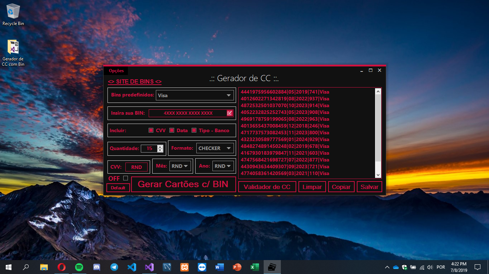
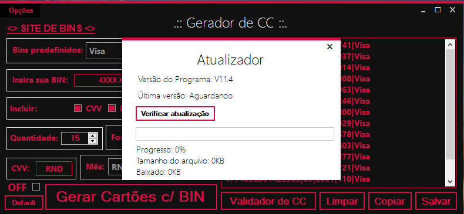
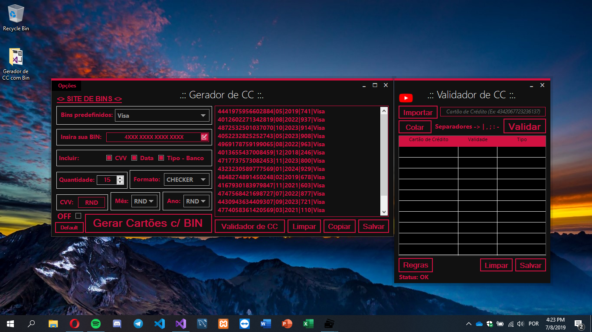
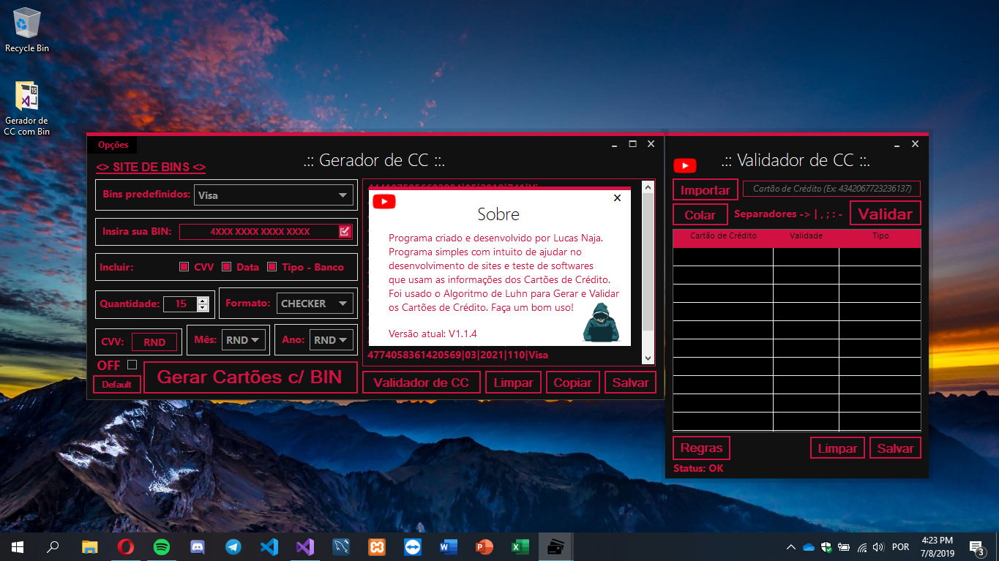
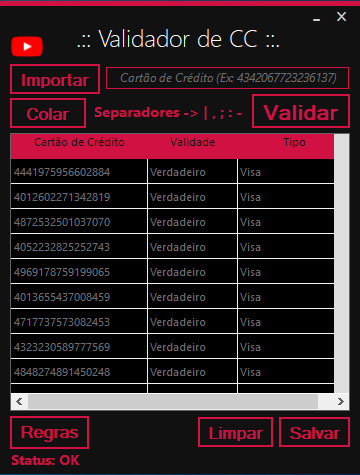

# Gerador e Validador de Cartão de Crédito

## Autor: Lucas Bittencourt
Criado em 2017, nessa época eu não utilizada padrões de código e boas práticas como hoje.
Utilizando C# como linguagem e Visual Studio como IDE.

## Descrição
O **Gerador e Validador de Cartão de Crédito** é feito utilizando o Algoritmo de Luhn. Nenhum Cartão gerado existe, são apenas números aleatórios e válidos. Usado para testes de Software em Desenvolvimento.

## Imagens
- Vídeo no YouTube bloqueado quando bateu quase 5.000 visualizações :p (e aumentando)

- Interface principal

- Sistema de Atualização integrado (não funcionando pois eu descontinuei o projeto então removi os links necessários. Mas é funcional e pode ser usado para estudos!)

- Interface após abrir o Validador (Ele reajusta os eixos X e Y dos forms para ficarem um do lado do outro)

- Formulário de Sobre do projeto (com um efeito de letras quando é aberto)

- Validador de Cartão de Crédito multi-opções.
